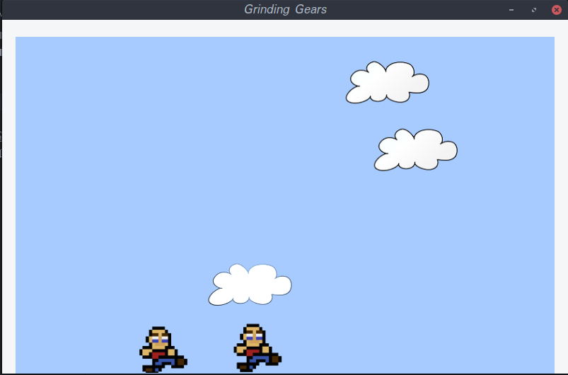

# MaelEngine
A 2D game engine in Julia

So far this is a very simple program. I am just learning to program and also just getting started on this project. 

### What it does so far...
So far MaelEngine draws some shapes, lines and sprites (optionally with alpha). It draws in a GTK window and reacts to keyboard input. You control the scene by assigning properties to an array of sprites. For example, if you change a sprite's direction or movement type then the sprite will respond accordingly.
